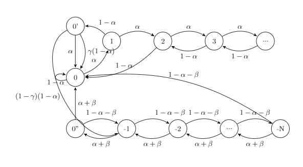
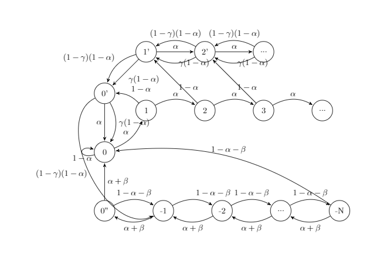

## Course project of EE357 Computer Network  

We learn about some attack methods in block chain, such selfish mining, stubborn mining and bribery attack, then we find some drawbacks of these methods, so we want to strengthen PoW-based-attack with bribery.  
Here we do some simulation experiments. We apply our policy both on selfish mining and lead-stubborn mining. In details, we extend the state space, here show the new state machines. 

 

We code and run some simulation experiments, the results and further discussions can be seen in our report. 

In file selfish_simulation.py, we implement selfish mining and selfish mining with bribery. 

In file stubborn_simulation.py, we implement lead-stubborn mining and lead-stubborn mining with bribery. 

Finally, I'm glad to cooperate with Xinyu Wang. 
